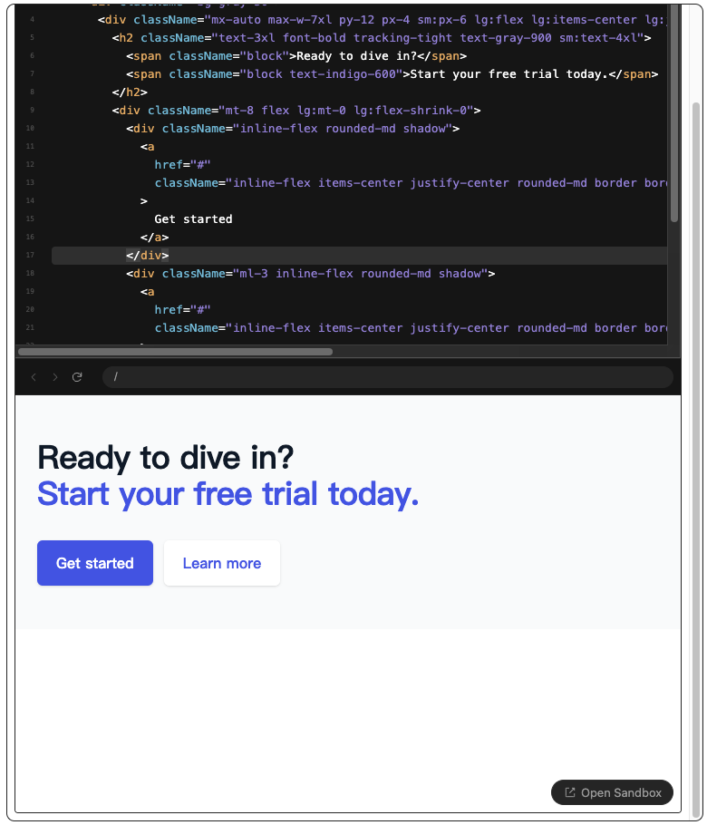

# Remark-codesandbox-sandpack

[](https://www.npmjs.com/package/remark-codesandbox-sandpack)
[](https://www.npmjs.com/package/remark-codesandbox-sandpack)
[](https://github.com/fwx5618177/remark-codesandbox-sandpack/actions)
[](https://coveralls.io/github/fwx5618177/remark-codesandbox-sandpack?branch=master)

Remark-CodeSandbox is a dynamic tool still under development, designed to run code snippets embedded in Markdown files directly in CodeSandbox. This tool leverages `react-sandpack` to provide a seamless experience in both node and browser environments.



## Current Status

- **Development:** The tool is currently in active development and more features are being added.
- **Support:** It already supports execution in both node and browser environments.

## Key Features

- **Integration with CodeSandbox:** Allows for Markdown embedded code snippets to be executed directly in CodeSandbox.
- **Environment Flexibility:** Runs seamlessly in both node and browser setups.

## Usage

To use Remark-CodeSandbox in your Markdown files, you need to include code snippets formatted in a specific way to specify the sandbox configuration. Below are the parameters that you can configure:

- `style`: CSS styles for the CodeSandbox container.
- `theme`: Theme of the CodeSandbox editor.
- `mode`: Defines the mode of the sandbox, currently it just could use `sandpack` to use this tool.
- `type`: Specifies the type of sandbox environment.
- `name`: Sets the name of the file in the sandbox.
- `external`: CodeSandbox's external loading links, for additional resources or libraries.

## Installation

To install Remark-CodeSandbox, you can use pnpm or yarn:

```bash
pnpm add remark-codesandbox-sandpack remark
```

Use with remark:

```javascript
import { remark } from 'remark';

remark().use(remarkSandpack, { mode: 'sandpack' });
```

Use in react-markdown:

```tsx
...
    <ReactMarkdown
      components={{
        code: SandpackStrategy,
      }}
      remarkPlugins={remarkPlugins}
      rehypePlugins={rehypePlugins}
    >
      {content}
    </ReactMarkdown>
...
```

```tsx
const SandpackStrategy = ({ props, children, node, language, className }) => {
  const { html, type } = props;
  const isLink = type === 'link';
  const blob = new Blob([html], { type: 'text/html' });
  const url = isLink ? html : URL.createObjectURL(blob);

  return (
    <div
      style={{
        margin: '2rem 0',
      }}>
      <iframe
        style={{
          width: '100%',
          height: 900,
          outline: '1px solid #252525',
          border: 0,
          borderRadius: 8,
          marginBottom: 16,
          zIndex: 100,
        }}
        src={url}></iframe>
    </div>
  );
};

export default SandpackStrategy;
```

### Example

Here is an example of how to embed a React component in Markdown to be run in CodeSandbox:

```react codesandbox=new?name=App.tsx&style=height:1000px;width:600px&theme=dark&mode=sandpack
export default function Example() {
  return (
    <div className="bg-gray-50">
      <div className="mx-auto max-w-7xl py-12 px-4 sm:px-6 lg:flex lg:items-center lg:justify-between lg:py-16 lg:px-8">
        <h2 className="text-3xl font-bold tracking-tight text-gray-900 sm:text-4xl">
          <span className="block">Ready to dive in?</span>
          <span className="block text-indigo-600">Start your free trial today.</span>
        </h2>
        <div className="mt-8 flex lg:mt-0 lg:flex-shrink-0">
          <div className="inline-flex rounded-md shadow">
            <a
              href="#"
              className="inline-flex items-center justify-center rounded-md border border-transparent bg-indigo-600 px-5 py-3 text-base font-medium text-white hover:bg-indigo-700"
            >
              Get started
            </a>
          </div>
          <div className="ml-3 inline-flex rounded-md shadow">
            <a
              href="#"
              className="inline-flex items-center justify-center rounded-md border border-transparent bg-white px-5 py-3 text-base font-medium text-indigo-600 hover:bg-indigo-50"
            >
              Learn more
            </a>
          </div>
        </div>
      </div>
    </div>
  )
}
```

# Contributing

Contributions to Remark-CodeSandbox are welcome! Whether it's feature suggestions, bug reports, or pull requests, any form of contribution is encouraged.
