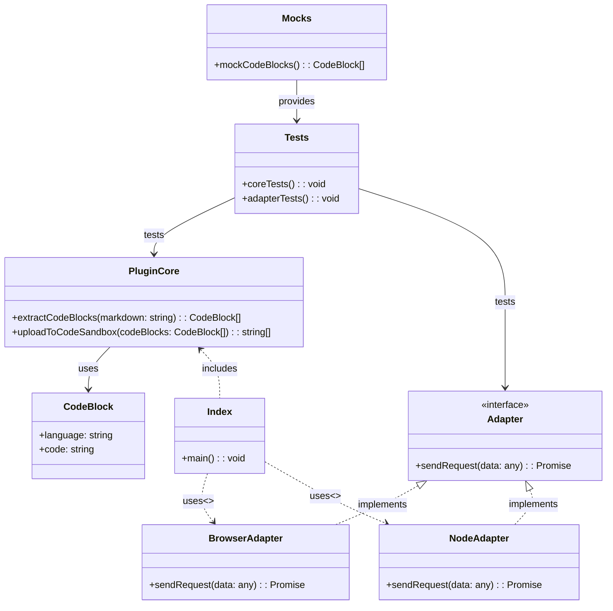

# Architecture

This document describes the architecture of the project.

```mermaid
classDiagram
    class PluginCore {
        +extractCodeBlocks(markdown: string): CodeBlock[]
        +uploadToCodeSandbox(codeBlocks: CodeBlock[]): string[]
    }

    class CodeBlock {
        +language: string
        +code: string
    }

    class Adapter {
        <<interface>>
        +sendRequest(data: any): Promise<any>
    }

    class BrowserAdapter {
        +sendRequest(data: any): Promise<any>
    }

    class NodeAdapter {
        +sendRequest(data: any): Promise<any>
    }

    class Index {
        +main(): void
    }

    class Tests {
        +coreTests(): void
        +adapterTests(): void
    }

    class Mocks {
        +mockCodeBlocks(): CodeBlock[]
    }

    PluginCore --> CodeBlock : uses
    PluginCore <.. Index : includes
    Adapter <|.. BrowserAdapter : implements
    Adapter <|.. NodeAdapter : implements
    Index ..> BrowserAdapter : uses<<conditional>>
    Index ..> NodeAdapter : uses<<conditional>>
    Tests --> PluginCore : tests
    Tests --> Adapter : tests
    Mocks --> Tests : provides
```